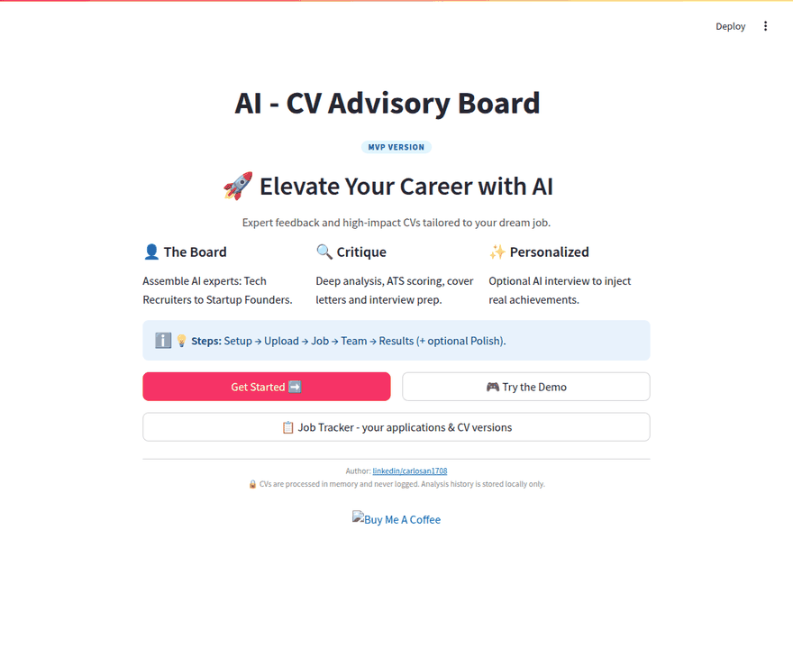
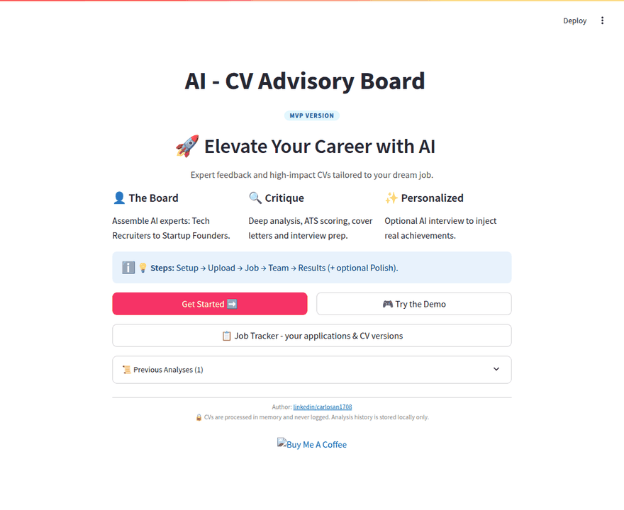
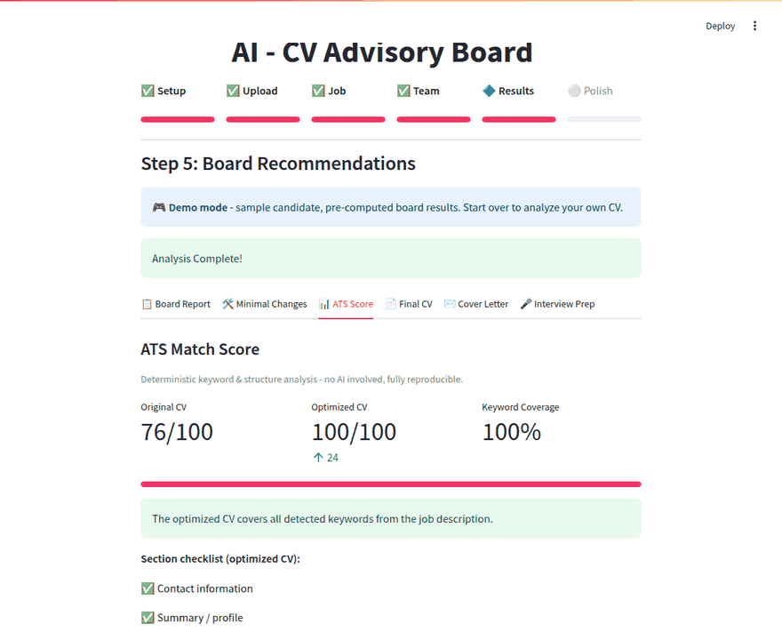

# AI - CV Advisor Board 📄🤖

# Live Demo: https://ai-cv-advisory-board.streamlit.app/

An AI-powered multi-agent system designed to analyze and optimize CVs. It uses **CrewAI** and **Streamlit** with **Google Gemini**, **OpenAI**, **Anthropic Claude** or local **Ollama** models to compare your CV against job descriptions and provide expert feedback from a "Board" of specialized agents.

[](https://creativecommons.org/licenses/by-nc-nd/4.0/)
[](https://www.python.org/downloads/)
[](https://streamlit.io/)

## 🚀 Overview

Collaborative AI deliberation to perfect your CV. Specialized AI agents (the "Board") review your CV from multiple perspectives, providing actionable feedback, an ATS match score, a professionally rewritten version, a tailored cover letter and interview preparation.

**Try it without an API key:** the welcome screen has a **🎮 Try the Demo** button - sample CV,
sample job, instant pre-computed board results.



### The full version (bring your own key)

The demo is a fixed-sample teaser - the full version is where the product lives. You pick a provider
(Google Gemini, OpenAI, Anthropic - or local Ollama, no key needed), upload your own CV
(PDF/DOCX/TXT), target any job posting, and customize the board:



### 🎮 Demo vs 🔑 Full version

| Feature | 🎮 Demo | 🔑 Full version |
|---|---|---|
| CV | Fixed sample candidate | **Upload your own** (PDF, DOCX, TXT) |
| Job description | Fixed sample posting | Paste any text or **extract from job URLs** (LinkedIn, Indeed, Greenhouse, ...) |
| Multi-job comparison | 🔒 | ✅ Score your CV against several postings at once |
| The Board | Fixed 2 specialists | **Any 3 of 20+ personas** across 11 industry packs |
| Persona Builder + YAML export | 🔒 | ✅ Create your own specialists |
| Debate round (Devil's Advocate) | 🔒 | ✅ |
| Analysis | Pre-computed sample results | **Live multi-agent CrewAI analysis** of your CV |
| ATS score dashboard | ✅ (sample data) | ✅ Your real before/after scores |
| Cover letter & outreach | ✅ (sample) | ✅ Tailored to your experience |
| Interview prep (STAR answers) | ✅ (sample) | ✅ Built from your real gaps |
| Personalize (Board Interview) | 🔒 | ✅ Rewrite incorporating your answers |
| Exports | PDF | PDF **and DOCX** |
| Providers & models | Not needed | Gemini, OpenAI, Claude, or local Ollama - any model |
| Analysis history | ✅ | ✅ |

## ✨ Features

- **Step-by-Step Wizard**: A guided process (Welcome, Config, Upload, Job, Team, Results).
- **Multi-Agent Collaboration**: Powered by **CrewAI** for sophisticated AI deliberation, with an optional
  **Debate Round** where a Devil's Advocate challenges the specialists before the final synthesis.
- **ATS Match Score**: Instant, deterministic keyword & structure scoring — including a before/after
  comparison of your original vs. optimized CV, and a **multi-job comparison** to decide where to apply.

  
- **Demo Mode**: one click on the welcome screen loads a sample candidate and pre-computed results —
  zero API cost, perfect for trying the product (and for the E2E test suite).
- **Access Control (optional)**: `AUTH_MODE=approval` gates the app behind request-access → admin
  approval → login, with an in-app admin panel (`ADMIN_CODE`). Demo stays available to visitors.
- **Job Targeting**: Extract job descriptions from LinkedIn, Indeed, Greenhouse, Lever and most other
  boards (schema.org JobPosting parsing), or paste them manually.
- **Custom Specialist Board**: 11 persona packs (tech, product, finance, healthcare, academia,
  sales & marketing, data & AI, ...) plus a **Persona Builder** with YAML export.
- **Professional Rewrite**: Get an optimized version of your CV as Markdown, **PDF** (Unicode-aware) or **DOCX**.
- **Cover Letter & Outreach**: Optional tailored cover letter, LinkedIn note and follow-up email.
- **Interview Prep**: Likely questions with STAR model answers built from the board's gap analysis.
- **History**: Past analyses persist locally (SQLite) or in Google Cloud Storage when hosted,
  with one-click "delete my data".
- **Multi-Provider**: Google Gemini, OpenAI, Anthropic Claude, or fully local via Ollama.
- **Cost Transparency**: Token usage reported after every run; retry with backoff on transient failures.

## 🏗️ Project Architecture

The application follows a scalable, service-oriented architecture designed for maintainability and growth:

```text
.
├── personas/           # YAML persona packs (role/goal/backstory schema)
├── src/                # Application source code
│   ├── app.py          # Main Streamlit entry point
│   ├── models.py       # Domain data models (Job, Persona, Config)
│   ├── state_manager.py# Centralized session state orchestration
│   ├── scraper.py      # Job posting extraction (JSON-LD + selectors)
│   ├── logger.py       # Structured application logging
│   ├── exceptions.py   # Custom domain exceptions
│   ├── services/       # Stateless business logic layer
│   │   ├── analysis_service.py # CrewAI orchestration (board, debate, cover letter)
│   │   ├── ats_service.py      # Deterministic ATS scoring & keyword analysis
│   │   ├── cv_service.py       # PDF/DOCX/TXT parsing & PDF/DOCX generation
│   │   ├── history_service.py  # Analysis history (SQLite locally, GCS when hosted)
│   │   ├── job_service.py      # Job scraping & extraction
│   │   ├── persona_service.py  # Persona management
│   │   └── config_service.py   # LLM & System configuration
│   └── steps/          # Modular UI components for the wizard
├── scripts/            # Development and CI/CD utilities
├── tests/              # Automated test suite (pytest)
├── requirements.txt    # Python dependencies
├── Dockerfile          # Container image (see docker-compose.yml)
├── .env.example        # Template for environment variables
└── README.md           # Project documentation
```

### Core Design Principles
- **Separation of Concerns**: UI code is decoupled from business logic.
- **Stateless Services**: Logic is encapsulated in reusable services.
- **Centralized State**: Application state is managed through a single `StateManager`.
- **Observability**: Built-in structured logging and custom error handling.
- **Privacy**: CVs are processed in memory and never logged; API keys are kept per-session and never
  written to shared environment variables; analysis history is session-scoped on hosted deployments.

## Prerequisites

- [Python 3.10+](https://www.python.org/downloads/)
- [Git](https://git-scm.com/downloads)
- An API key for Google AI (Gemini), OpenAI or Anthropic — or a local [Ollama](https://ollama.com/) server (no key needed)

## Getting Started

### 1. Clone the Repository

```bash
git clone https://github.com/carlosan1708/ai-cv-advisor-board
cd ai-cv-advisor-board
```

### 2. Set Up the Python Environment

#### On macOS/Linux:
```bash
python3 -m venv venv
source venv/bin/activate
```

#### On Windows:
```bash
python -m venv venv
.\venv\Scripts\activate
```

#### Install Dependencies:
```bash
pip install -r requirements.txt
```

#### Development Setup (Optional):
If you plan to contribute, install development tools and pre-commit hooks:

```bash
pip install -r requirements-dev.txt
pre-commit install
```

To run pre-commit checks manually on all files:

```bash
pre-commit run --all-files
```

### 3. Environment Setup

Create a `.env` file in the root directory:

```bash
cp .env.example .env
```

Edit `.env` and add your `GOOGLE_API_KEY` (or other keys as needed).

### 4. Run the Application

```bash
streamlit run src/app.py
```

The application will be available at `http://localhost:8501`.

### Alternative: Run with Docker

```bash
cp .env.example .env   # add your keys
docker compose up --build
```

## ☁️ Deploy to Google Cloud (Cloud Run + Cloud Storage)

The app runs as a container on Cloud Run, with analysis history persisted to a GCS bucket:

```bash
export GOOGLE_API_KEY=your-gemini-key
./scripts/deploy_gcp.sh YOUR_PROJECT_ID
```

See [docs/DEPLOY_GCP.md](docs/DEPLOY_GCP.md) for the full guide (storage backends, IAM,
secrets, costs and privacy).

## 🧪 Testing

```bash
python -m pytest              # unit tests (fast, no browser)
python -m pytest tests_e2e    # end-to-end tests (Playwright, uses demo mode)
```

For the E2E suite locally, install browsers once with `python -m playwright install chromium`.
CI runs linting, the unit suite, and the full Playwright E2E suite on every push and pull request.
README GIFs and the screenshots in [docs/UX_REVIEW.md](docs/UX_REVIEW.md) are regenerated with
`python scripts/record_demo.py`.

## 🎭 Personas

Personas are plain YAML files in `personas/` — the easiest way to contribute. See
[docs/PERSONAS.md](docs/PERSONAS.md) for the schema and a contribution guide. You can also build
custom personas in-app (Step 4) and export them as YAML.

## 🛠️ Tech Stack

- **Frontend**: [Streamlit](https://streamlit.io/)
- **Agent Orchestration**: [CrewAI](https://www.crewai.com/)
- **LLM Framework**: [LiteLLM](https://www.litellm.ai/)
- **LLMs**: [Google Gemini](https://ai.google.dev/) (default), [OpenAI](https://openai.com/), [Anthropic Claude](https://www.anthropic.com/), [Ollama](https://ollama.com/) (local)
- **Documents**: [PyPDF](https://pypi.org/project/pypdf/), [FPDF2](https://py-pdf.github.io/fpdf2/), [python-docx](https://python-docx.readthedocs.io/)

## 🤝 Contributing

Contributions are welcome! Please see [CONTRIBUTING.md](CONTRIBUTING.md) for guidelines.

## 📄 License

This project is licensed under the **Creative Commons Attribution-NonCommercial-NoDerivs 4.0 International (CC BY-NC-ND 4.0)** License. See the [LICENSE](LICENSE) file for details.
